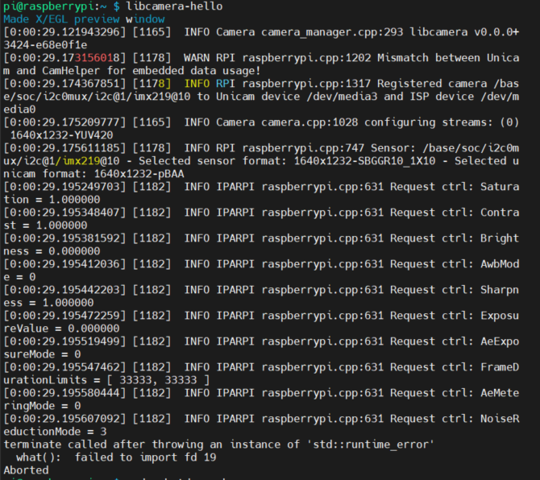

# 카메라 세팅

## 상황1

- 사용 중인 라즈베리파이: Raspberry Pi 4 B
- 사용 중인 카메라: Pi Camera V2
- 사용 중인 OS: Raspberry Pi OS Full (32bit) 2022-04-04 released  
참고로 64bit도 2022-04-04에 released된 Bullseye 버전은 오류가 동일
- `raspistill`을 사용하면 
**`ERROR: the system appears to be configured for the legacy camera stack`**  발생
- `libcamera-hello` 를 사용하면

<p align="center">
    
</p>

발생

- `raspi-config`를 통해 camera enable을 진행했던 상태  
이 때도 deprecated 된 기능이라는 warning이 뜨긴 함
- /dev/video0이 busy 하기 때문에 사용할 수 없다는 에러가 뜨기도 했는데
    
    ```
    $ sudo fuser /dev/video0
    사용중인 process 번호 확인
    $ sudo kill -9 [process 번호]
    ```
    
    를 진행해도 위 사진처럼 `failed to import fd 19`  에러 발생
    
- 당연히 변화를 줄 때마다 reboot 했음
- warning 사항에 mismatch가 발생했다고 하길래 `/boot/config.txt` 의 `dtoverlay` 를 사용중인 카메라인 Pi camera V2에 맞춰 변경해줬고 `camera_auto_detected=0` 으로 설정하여 수동으로 조절할 수 있도록 함
- 그리고 당연히 여러 번 OS를 새로 구워서 시도해보기도 함

## 원인 분석

- raspberry pi OS가 Debian Bullseye로 변경하면서 새로운 라이브러리인 `libcamera-apps` 를 도입하게 됨
- 실제로 Linux에서 복잡한 카메라 사용을 편리하게 도와주는 새로운 오픈 소스 소프트웨어로 `libcamera` 를 도입하기로 했고 이에 맞춰 RPI에서도 lite한 버전인 `libcamera-apps`를 사용하기로 했다는 게 RPI 공식 홈페이지의 입장
- 따라서 `libcamera-apps` 가 Debian Bullseye(2022-04-04 released 되어 RPI imager에 올라가 있는 버전)부터는 기본적으로 설치가 되어 있음
- 기존에 사용하던 `Buster` 에 사용하기 위해서는 libcamera-apps를 따로 설치해야 함
- Bullseye에서는 카메라의 종류를 자동적으로 파악하여 enable 해주기 때문에 이전에 Buster에 존재하던 raspi-config의 camera enable 항목이 deprecated 된다는 경고를 띄우고 RPI desktop에서 확인할 때는 아예 configure에 해당 항목이 존재하지도 않음
- 본인은 실제로 Debian Bullseye를 사용하고 있었고(RPI imager에서 권고하는 대로 설치했기 때문에) 카메라를 잘 연결했음에도 위와 같은 이슈가 발생했음
→ 아무래도 아직 이슈가 존재하는 듯?

## 해결 방안

- 일단 급한 대로 legacy 버전을 사용하여 `raspistill` 명령어로 카메라를 실행하니 바로 잘 됨
- legacy 버전의 Debian Buster에 맞춰진 개발 환경을 사용하고 있었기 때문에 legacy 버전을 사용하기로 함

## 참고한 것

- RPI libcamera 공식 홈페이지[https://www.raspberrypi.com/documentation/accessories/camera.html#getting-started](https://www.raspberrypi.com/documentation/accessories/camera.html#getting-started)
- 오류 해결 시도할 때 참고한 것 1 [https://unix.stackexchange.com/questions/113893/how-do-i-find-out-which-process-is-using-my-v4l2-webcam](https://unix.stackexchange.com/questions/113893/how-do-i-find-out-which-process-is-using-my-v4l2-webcam)
- 오류 해결 시도할 때 참고한 것 2 [https://githubhot.com/index.php/repo/Qengineering/RPi-image/issues/11](https://githubhot.com/index.php/repo/Qengineering/RPi-image/issues/11)
- RPI legacy에 관한 내용 [https://www.raspberrypi.com/news/new-old-functionality-with-raspberry-pi-os-legacy/](https://www.raspberrypi.com/news/new-old-functionality-with-raspberry-pi-os-legacy/)
- RPI legacy일 때 libcamera 사용 [https://youtu.be/1qx12adIFXc](https://youtu.be/1qx12adIFXc)

→ 이 외에도 Bullseye 버전을 사용하면 wavego 기존 코드가 동작하지 않는 등 문제가 많으므로 legacy 버전인 Buster를 프로젝트에서 사용하는 것으로 함

---

## 상황2

- 사용 중인 라즈베리파이: Raspberry Pi 4 B
- 사용 중인 카메라: Pi Camera V2
- 사용 중인 OS: Raspberry Pi OS legacy (with Debian Buster)
- WAVEGO에 포함되어 있는 setup.py로 설정 진행
- `[setup.py](http://setup.py)` 를 하기 전에는 `raspistill` 로 촬영 했을 당시 잘 동작함
- `[setup.py](http://setup.py)` 실행 후
    - `raspistill` 실행 시 **`ERROR: the system appears to be configured for the legacy camera stack`** 발생
    - `libcamera` 실행 시 mismatch 한다는 에러 발생(위 사진과 비슷하나 fd 9까지 가지도 않음)
    
    발생
    
- `/boot/config.txt` 에서
    
    ```
    camera_auto_detect=1
    dtoverlay=imx219
    ```
    
    해도 동일 함
    
    camera_auto_detect=0 조합, 아예 없는 상태 다 해 봤지만 여전히 동일한 에러 발생
    

## 결론

- wavego에서 사용하는 pi가 아닌 pi에서는 setup.py를 실행하지 말고 각자 opencv, numpy 등을 apt get으로 설치하여 개발 → 개발된 코드만 wavego에 옮겨서 통합