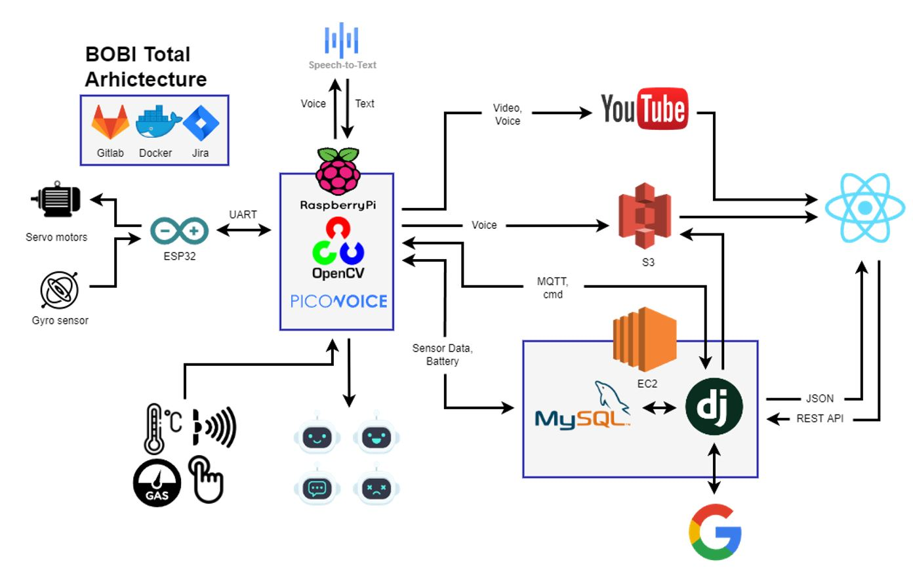

- 웹과 임베디드 전공반이 한팀이 되어 진행된 프로젝트 보비(BoBi)
- notion: https://www.notion.so/BOBI-99c240017e584ee1aba5d5fd013e6766
- jira: https://ssafy208.atlassian.net/jira/software/projects/BOBI/boards/1

   

# BoBi 
`SSAFY 공통프로젝트`  
`SSAFY 7기 2반 8팀`

> 보비 [명] 보조하여 돌봄  

## 👫 아이용 케어 로봇 친구

## 👀 부모님에게는 실시간으로 아이를 볼 수 있는 기능  

- 👯 아이를 인식하여 따라다니는 기능  
- 🗂️ 아이의 특별한 순간을 아카이빙 하여 저장 가능  
- 🚨 실시간으로 위험 상황 확인 가능  
- 💌 아이와 음성 메시지 주고 받기 가능  

## 👫 아이에게는 함께 해주는 친구로서의 기능

- 🔉 친해지면 특별한 이야기를 들려주는 친구 기능
- 💌 부모님과 음성 메시지로 소통하는 기능

## 🤖 BoBi can do...

🖱️ 이미지를 클릭하면 영상을 볼 수 있어요!  

1. 음성 명령에 따른 제스처
- 앉아  

- 일어나  
  

- 그 외 `왼손`, `왼손`, `엎드려`, `잘했어`와 `춤추자`를 할 수 있어요!
2. 아이 팔로잉
- 팔로잉  
  
- 보비 시점  
  
3. 사족 보행  

4. 이야기 들려주기
- 새로운 기억이 생각났어  
  
- 이야기 들려주기  
  

5. 음성 메시지 주고 받기  

6. 전용 웹페이지  

> for more info, visit our [**wiki!!**](https://lab.ssafy.com/s07-webmobile3-sub2/S07P12A208/-/wikis/home)

## Git Structure

`master`

- [/DOCS](./DOCS): 아이디어 기획, 개발 팁, 시연 영상(UCC) 등의 문서 정리

- [/exec](./exec): 포팅 매뉴얼, 시연 시나리오 등 최종 제출 문서

- [/HW](./HW): 하드웨어 개발 내용
  - [/HW/DESIGN](./HW/DESIGN): 외관을 위한 3D 모델링 파일
  - [/HW/DOCS](./HW/DOCS): HW 전체에서 볼 문서
  - [/HW/GESTURE_SENSOR](./HW/GESTURE_SENSOR): 터치 센서, 친밀도 관련 파일
  - [/HW/MQTT](./HW/MQTT): 웹&로봇 간 통신을 위한 MQTT 파일
  - [/HW/OBJECT_DETECTION](./HW/OBJECT_DETECTION): 아이 학습 데이터 + 학습 시킨 xml 파일
  - [/HW/OPENCV](./HW/OPENCV): 타겟 detect + following 파일
  - [/HW/SENSORS](./HW/SENSORS): 각종 센서 연결법 + testing 파일
  - [/HW/STREAMING](./HW/STREAMING): YouTube live 연결법
  - [/HW/VOICE_DETECTION](./HW/VOICE_DETECTION): 음성 인식과 상응하는 로봇 표정 파일
  - [/HW/WAVEGO](./HW/WAVEGO): 로봇 구동을 위한 아두이노 파일
  
- [/WEB](./WEB): 웹페이지 개발 내용
  - [/WEB/BE](./WEB/BE): Django 백엔드 프로젝트 파일
  - [/WEB/FE](./WEB/FE): React 프론트엔드 프로젝트 파일
  - [/WEB/FE + BE](./WEB/FE + BE): 실제 서버 배포 시 사용하는 프론트엔드 + 백엔드 빌드 파일

## Total Architecture

- 기획  

- 최종  
 

## Members

|이름 | 이메일 | 역할 |
|---|---|---|
|곽다원 | wings4608@gmail.com | 3D modeling, Robot movement |
|김동원 | kdw324400@gmail.com | Voice recognition, MQTT |
|신선영 | sunyeong0412@naver.com | BE, Deploy, Server, FE(Sensor, Story), Design|
|이승훈 | a01038517287@gmail.com | FE(Login, Archive, Voice, Remote Control)|
|장명근 | jang23mg@naver.com | Team Leader, Robot movement, Video detection , FE|
|정재훈 | jaeung644@gmail.com | Voice recognition, Video detection, Sensors |
