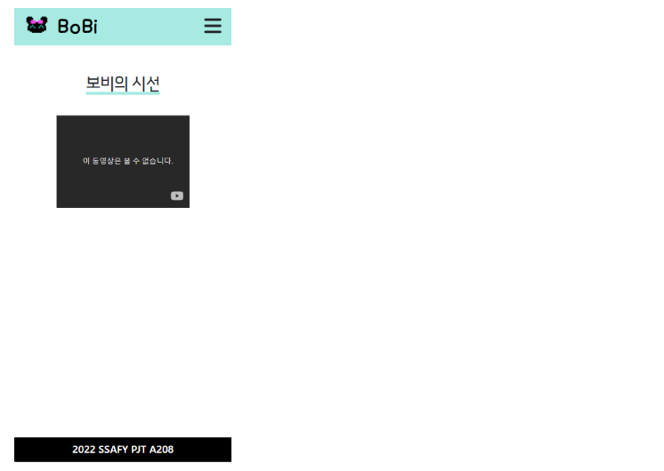
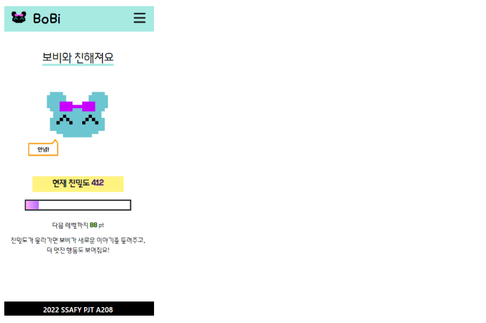
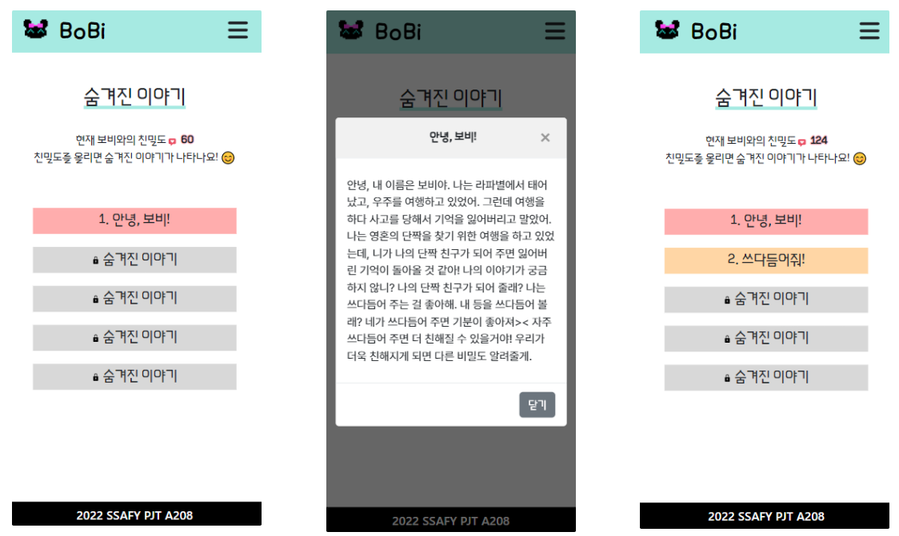
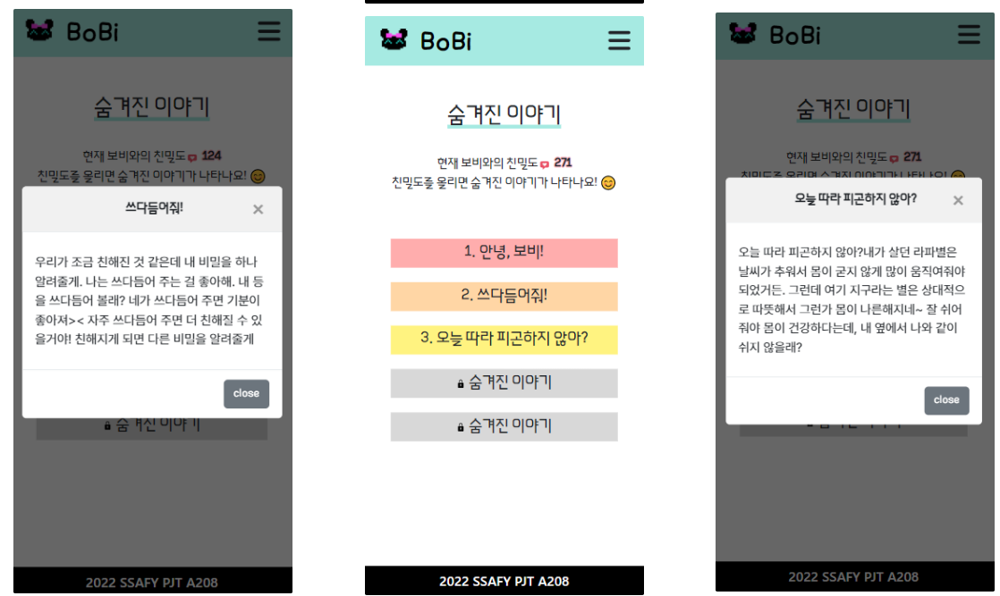
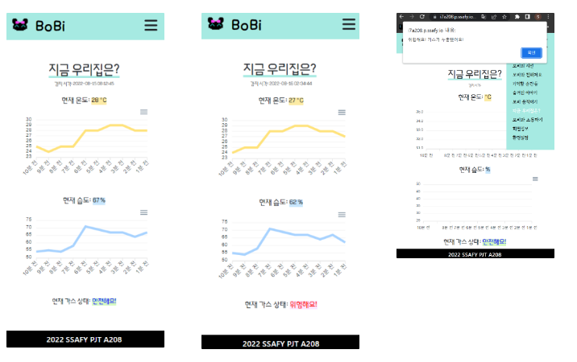
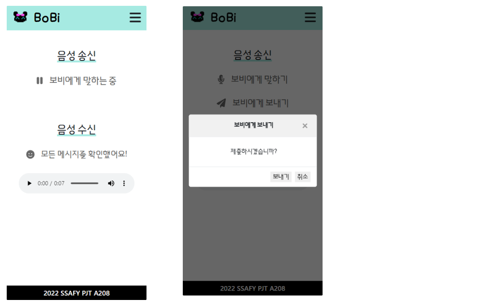
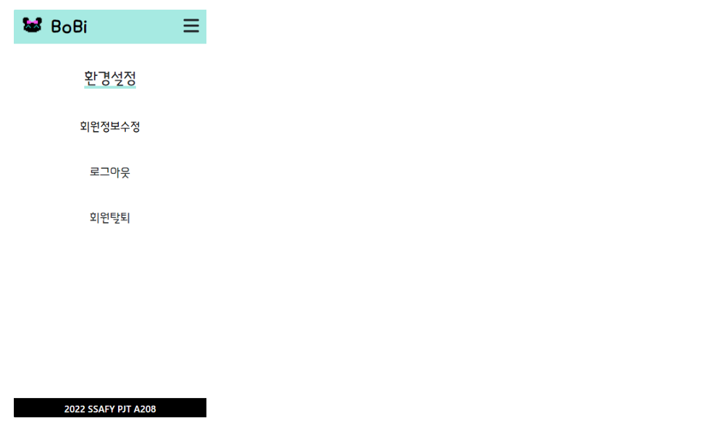

# BoBi - Web

> 관찰형 반려 케어 로봇 BoBi  ::  *보비[명] 보조하여 돌봄*
>
> 배포서버 👉 https://i7a208.p.ssafy.io/


## 👨‍💻 팀원 소개 및 업무 분담

**FE (+BE) / Web** [이승훈](https://github.com/2squarehoon)  

**BE (+ FE) / Web** [신선영](https://github.com/drsuneamer/TEMPLIX-2022/blob/master/[]())


## 🗓 프로젝트 기간

`2022. 07. 05 ~ 2022. 08. 19`


## 🛠 기술 스택

**FrontEnd**  React / JavaScript / HTML / CSS / Bootstrap / MQTT / S3

**BackEnd**  Python / Django 


## 🤖 프로젝트 구현

#### 페이지 소개

> Samsung Galaxy S8+ 기준 캡처 페이지

- `보비의 시선` 실시간 영상

- `보비와 친해져요` 친밀도(경험치) 확인

- `기억할 순간들` 영상 아카이브

- `숨겨진 이야기` 친밀도에 따른 스토리 해금

- `보비 움직이기` MQTT 통한 로봇 원격 조작

- `지금 우리집은?` 센서를 통한 온습도/가스 상태 확인

- `보비와 소통하기` 음성메시지 송수신


###### 기본 페이지 (https://i7a208.p.ssafy.io/)

- 상세 메뉴

  


###### 실시간 영상 (https://i7a208.p.ssafy.io/live)

- 보비가 촬영중인 영상 유튜브라이브로 실시간 확인 가능

  


###### 친밀도 (https://i7a208.p.ssafy.io/friendliness)

- 현재 친밀도 확인, 다음 레벨 (새로운 스토리와 행동 해금)까지 남은 친밀도 확인

  


###### 스토리 (https://i7a208.p.ssafy.io/story/)

- 친밀도에 따라 스토리 해금 및 확인 가능

- 친밀도는 로봇을 쓰다듬거나 명령어를 작동시키는 등의 행동에 의해 상승

- `0` 기본 스토리[1] 공개  `100` 달성 시 [2] 공개 `200` [3] `300` [4] `400` [5]

  

  

  

  


###### 로봇 조작 (https://i7a208.p.ssafy.io/control)

- 유튜브 라이브로 실시간 영상을 확인하며, 전후좌우 조작 가능

- 허용된 이메일 (현재는 관리자인 carerobotbobi 계정)으로 접속해야 조작 가능

  


###### 센서 페이지 (https://i7a208.p.ssafy.io/sensor)

- 감지 시간 / 현재 온도 / 현재 습도 / 가스 상태 표시

- 최근 10개 데이터를 포함한 그래프 출력

- 가스 상태: 이상 감지 시 `위험해요` 표시, 미감지 시 `안전해요` 표시

- 가스 위험 상태시 `위험해요! 가스가 누출됐어요!` 경고창 출력

  !


###### 음성 송수신 (https://i7a208.p.ssafy.io/voice/)

- 수신

  - 새 메시지 도착 시 `새로운 메시지가 도착했어요!` 문구 확인 가능
  - 확인 후 메시지 클릭 시 `모든 메시지를 확인했어요!` 로 변경

- 송신

  - `보비에게 말하기` 버튼 클릭 후 녹음 완료 시 `보비에게 보내기` 버튼 생성
  - 클릭 시 `제출하시겠습니까?` 문구 출력

  


###### 로그인 (https://i7a208.p.ssafy.io/login)

- 메인 페이지로 접속 시 로그인이 되어 있지 않으면 로그인 페이지로 이동

- 로그인 완료 시 사용자 상세 정보 입력 페이지로 이동 (https://i7a208.p.ssafy.io/user-detail)

  


###### 회원정보 (https://i7a208.p.ssafy.io/user/)

- 닉네임, 유튜브 계정 입력 시 회원정보 확인 가능

  


###### 환경설정 (https://i7a208.p.ssafy.io/config) 

- 회원정보수정, 로그아웃, 회원탈퇴 가능

  

  

#### URL

```
# 웹페이지
https://i7a208.p.ssafy.io/     // 메인 페이지
https://i7a208.p.ssafy.io/intro      // 설정 소개 페이지
https://i7a208.p.ssafy.io/live    // 실시간 유튜브 라이브 영상 재생
https://i7a208.p.ssafy.io/friendliness     // 현재 친밀도 확인
https://i7a208.p.ssafy.io/archive-video    // 영상 아카이브
https://i7a208.p.ssafy.io/story     // 스토리 텍스트 확인
https://i7a208.p.ssafy.io/control     // 로봇 조작 (배포 서버에서는 작동 X)
https://i7a208.p.ssafy.io/sensor     // 센서 데이터 확인
https://i7a208.p.ssafy.io/voice     // 음성 메시지 송수신
https://i7a208.p.ssafy.io/login // 로그인_미로그인시에만 접근 가능
https://i7a208.p.ssafy.io/user-detail  // 사용자 상세 정보 입력, 정보를 입력하지 않았을 시에만 접근 가능
https://i7a208.p.ssafy.io/user    // 회원정보 확인
https://i7a208.p.ssafy.io/config    // 환경설정

# api (DB 확인)
https://i7a208.p.ssafy.io/api/v1/sensors/    // 센서 데이터
https://i7a208.p.ssafy.io/api/v1/robots/    // 경험치
https://i7a208.p.ssafy.io/api/v1/stories/     // 스토리
https://i7a208.p.ssafy.io/api/v1/voicecheck/    // 음성 수신 알림
https://i7a208.p.ssafy.io/api/v1/archivevideos/    // 영상 아카이브
https://i7a208.p.ssafy.io/api/v1/fakeusers/     // 사용자
```


## 😢 목표서비스 구현 실패 목록ㅠㅠ

- PWA 앱 형태 (가스 감지 시 푸쉬 알림 등)  -- PC로 페이지 접속 시 모바일 환경에 최적화되어있다는 정보 제공
- 이미지 아카이브 - youtube 재생 화면 client side 캡처 오류 등의 문제
- https 환경 웹소켓 연결


## 🌳 전체 개요 - 파일트리

#### FE

```
📂 bobi_frontend
├─build
├─node_modules		// 설치 완료된 모듈
├─public
│  ├─index.html
│  ├─manifest.json
├─src
│  App.css
│  App.jsx
│  index.css
│  index.js
│  
├─components
│  │  ArchiveDropdown.js		// 사용 X
│  │  ControlButton.jsx
│  │  ControlButtonDummy.jsx		// 배포용 작동 X 버튼
│  │  Dropdown.js
│  │  GoogleButton.js		// 구글 로그인 버튼
│  │  Graph.jsx			// 온도 그래프
│  │  Graph1.jsx		// 습도 그래프
│  │  UserForm.jsx
│  │  
│  ├─archive
│  │      ArchiveForm.jsx
│  │      ArchiveImageForm.jsx
│  │      ArchiveImageItem.jsx
│  │      archiveImageWrite.jsx
│  │      ArchiveVideoForm.jsx
│  │      ArchiveVideoItem.jsx
│  │      
│  ├─modal
│  │      Modal.js
│  │      VoiceModal.js
│  │      
│  ├─story
│  │      HiddenStory.jsx	// 해금 X 스토리 (클릭 X)
│  │      StoryItem1.jsx
│  │      StoryItem2.jsx
│  │      StoryItem3.jsx
│  │      StoryItem4.jsx
│  │      StoryItem5.jsx
│  │      
│  └─voice
│          VoicePlay.jsx
│          VoiceRecord.jsx
│          
├─layout
│  │  Layout.jsx	 // 전체 레이아웃 적용
│  │  
│  ├─footer
│  │      Footer.jsx
│  │      
│  └─header
│          ArchiveMenu.jsx
│          Header.jsx
│          HeaderMenu.jsx
│          
└─pages
    │  Config.jsx		// 환경 설정
    │  Control.jsx		// 로봇 조작
    │  Friendliness.jsx		// 친밀도
    │  Intro.jsx		// 서비스 소개
    │  Live.jsx		// 실시간 영상 확인
    │  Login.jsx		// 로그인
    │  Main.jsx		// 메인 페이지	
    │  Sensor.jsx		// 센서 값 확인
    │  Story.jsx	// 해금된 스토리
    │  User.jsx
    │  UserDetail.jsx
    │  UserDetailEdit.jsx
    │  Voice.jsx		// 음성 송수신
    │  	
    └─archive
            ArchiveImage.jsx
            ArchiveImageDetail.jsx
            ArchiveImageUpdate.jsx
            ArchiveVideo.jsx
            ArchiveVideoDetail.jsx
            ArchiveVideoUpdate.jsx
            ArchiveVideoWrite.jsx
└─package.json  	// 설치 패키지 정보
```

#### BE

```
📂 BoBi
├─.config	// 서버 배포용 설정 파일
│  ├─nginx
│  └─uwsgi
├─accounts		// user 정보
├─archives			// 영상 아카이브
├─bobi			// 센서, 친밀도 등 로봇 저장 데이터
├─bobi_backend		// url, DB 세팅 등
├─bobi_frontend		// FE 빌드 파일	
├─movements
├─stories
├─voices
└─my_settings.py		// DB 설정 등 (개인정보 포함)
```


## 🙂 느낀점

- 신선영

  1학기 관통 프로젝트와는 느낌이 사뭇 달라서 계속 새로운 느낌이 들었습니다. 임베디드라는 아주 새로운 트랙에서 많은 것을 배우고, 경험할 수 있어서 좋았습니다.

  앞으로 공부를 어떻게 해나가야 할지에 대해서도 많은 생각을 했고, 스스로의 책임이나 부담감, 소통에 대해서도 많은 고민을 할 수 있는 기회였습니다.

  프로젝트가 하나씩 끝나갈 때마다 많은 것을 배워가는 것 같습니다. 앞으로의 일정이 기대되기도, 걱정되기도 하지만 지치지 않고 꾸준히 해나가고 싶습니다!


- 이승훈

  1. 백엔드를 Django로 구현했다는 점과 웹을 2명이서 A부터 Z까지 다 해야 한다는 것이 1학기 최종 프로젝트의 연장선 같았다. 다만 해야 할 것이 훨씬 많았고 요구수준도 훨씬 높았다.

  2. 이정표 없이 머리 박아가며 배우는 느낌이었다. 지금 내가 하고 있는 것이 쉬운 것인지 어려운 것인지 구분도 되지 않았다. 수많은 블로그를 읽고 수많은 코드들을 봐도 로그인 기능을 구현하지 못하는 것이 내가 멍청해서 그런 건지 진짜 어려운 개념이라 초심자가 헤맬 수밖에 없는 것인지 몰랐다. 클라이언트 사이드에서의 로그인도 시도해 보고 서버사이드에서의 로그인도 시도해 보았으나 token, jwt 등 인증정보를 처리하는 것을 코드로 구현하는 것이 너무나도 힘들었다. 심지어 나는 프론트엔드 지망이었어서 Django 코드를 읽고 수정하기 위해 1학기 때 배웠던 것을 따로 복습까지 해야 했다. 나중에 알아보니 백엔드 컴퓨터공학 전공자 한 명이 서버 부분 로그인만을 구현하기 위해서 1주일은 넘게 쏟아부어야 하는 작업이라더라.

  3. Figma는 어느 정도 수준까지 작성해야 하는지, API 문서가 뭔지, Swagger가 뭔지, 아무것도 몰랐다. 다른 조에서 Swagger를 써서 API 문서를 예쁘게 작성해놓은 것을 보고 Swagger 코드를 한 줄 한 줄 수정해가며 작성하다가 이게 뭐 하는 짓인가 싶어서 그만했었다. 알고 보니 Java Springboot에 입력하면 Swagger 문서를 자동으로 작성해 준다고 하더라. Figma 작성도 그냥 어떤 기능들이 있고 어떻게 구현되는지 적당히만 보여주면 되는 줄 알았는데 그게 아니라 벌어질 상황에 대한 모든 사건들을 기록해야 하고 디자인도 실제로 구현됐을 때 보이는 만큼 확실하게 그려야 했다. 코치님이 처음에 보고 경악을 하셨는데 처음엔 이해가 되질 않았는데 역시 다른 조의 Figma를 보니 왜 그러셨는지 이해가 됐다.
  4. 프로젝트 2번째 주에 ERD를 짜고 컴포넌트 구조도를 짠 것 중에 그대로 간 것이 거의 없는 것 같다. 이건 아마 다른 조도 마찬가지이지 않을까? 제발 그랬으면 좋겠다.
  5. 당연히 될 것이라고 생각했던 기능 중에 생각보다 힘들었거나, 아예 구현이 되지 않는 것들이 있었다. 유튜브 라이브를 웹에서 송출하면서 특정 버튼을 누르면 송출되는 유튜브 화면을 캡처하는 기능을 만들고 싶었다. 그냥 사용자 입장에서 화면 캡처는 일도 아니지만 이것을 웹 클라이언트 사이드에서 구현하는 것은 사실상 불가능에 가까웠고 결국 기능 하나를 폐기 처리했다. 그리고 웹<=(웹소켓)=>mosquitto<=mqtt=>라즈베리 파이 연결을 통해 웹에서 로봇을 구동하는 기능을 만들고 싶었는데 http 환경에서는 잘 연결이 되었는데 https 환경에서는 ssl 이슈가 뜨면서 연결이 되지 않았다. 웹 기술하는 조에서 soket.io 통신을 진행한 조가 있어 조언을 구한 결과 nginx 프록시 설정도 바꾸고 했는데도 여전히 통신이 되지 않았다. 또한 클라이언트 사이드에서 음성을 녹음하고 파일 형태로 만들어서 S3로 보내는 것까지는 성공했다. 재생되는 것까지도 확인했다. 그런데 녹음한 음성을 파일 형태로 만들면서 인코딩이 제대로 되지 않아 라즈베리 파이에서는 재생이 제대로 되지 않았다. 백엔드에 녹음한 음성을 보내고 인코딩을 진행해서 S3로 쏴줬어야 했는데 Django 이해도도 많이 부족하고 시간이 부족해서 사실상 포기했다.
  6. 한창 프로젝트를 진행해야 할 때 코로나에 걸렸다. 다행히 증상이 심했던 편은 아니라 이틀 정도만 쉬고 쭉 참여했다. 코로나에 걸려 사유 결석하는 주간 내내 로그인 관련 자료를 찾고 적용해 보고 여러 라이브러리를 받아서 시도해 보고 했는데도 잘되지 않았다. 그러다가 stackoverflow에서 한 코드를 보고 따라 쳐서 로그인이 제대로 구현됐을 때 그때의 쾌감은 아직도 잊을 수가 없다. 완전히 멘탈이 깨져있는 상태에서 어떻게든 로그인을 성공시켰다는 것만으로도 만족스러웠다. 물론 클라이언트 사이드에서 로그인을 하고 토큰을 서버사이드에 보내고 서버사이드에서 다시 구글로 인증토큰을 받아오는 일련의 과정을 다 구현하지는 못했다. 아니 그냥 사실상 야매로 진행했다... 그래도 굉장히 만족스러웠다. 그리고 앞서 언급했던 웹소켓 mqtt 통신을 수많은 자료들을 찾아보고 구글링을 했는데도 실마리를 잡지 못하다가 어느 중국 블로그를 보고 실마리를 얻었다. 그 블로그를 참고하여 코드를 수정하여 처음 웹에서 버튼을 눌러 로봇을 구동시키는 데에 성공했을 때, 그때 마침 코치님에게 질문을 해서 웹엑스 접속 후 소통하는 중이라 기쁨을 온전히 표현하지 못한 게 조금 아쉬웠다.
  7. 나랑 선영이 둘이서 다 만들었던 웹사이트를 누군가가 봤을 때는 별 기능도 없고 보잘것없지 않냐고 할 수도 있을 것 같다. 그런데 이건 불과 몇 개월 전까지만 하더라도 파이썬의 ㅍ도 모르는 사람 둘이서 만들었다는 것을 꼭 염두에 두고 봐줬으면 좋겠다.
  8. 선영이랑 둘이서 웹을 진행하면서 이상하리만큼 구체적인 업무 분담에 대한 회의가 거의 없었다. 서로 각자 알아서 할 것을 찾아서 했고 그러는 과정에서 서로가 담당하는 영역이 암묵적으로 확 구분이 되었다. 호흡이 굉장히 잘 맞는 파트너이자 서로의 힘듦을 누구보다 잘 알고 위로도 해주는 서로의 멘탈 관리자였다. 나도 프론트엔드에서 주요 기능들 구현하는 것들이 힘들었다만 백엔드 구축, 서버 관리, 배포 등 특히 굳은 일을 도맡아 한 선영이에게 미안하고 고맙다. 정말 고생 많았어 넌 어딜 가서도 무조건 1인분은 할 거야. 내가 프로젝트 진행하면서 알게 된 것들을 최대한 많이 공유하고 싶은데 왜 Vue를 하죠?
  9. 힘들다고 푸념만 한 것 같지만 하기 싫고 엄청 고통스럽고 짜증 나고 그랬으면 진작에 많은 부분을 내려놨을 것이다. 삽질을 수없이 반복했지만 어떻게든 구현해 내고 싶었고 구현하는 과정이 재미도 있었다. 다루는 주제도 재미있어서 많이 웃으면서 진행했던 즐거운 프로젝트였다고 생각한다. 보비 너무 귀엽다. 다른 사람들도 우리 보비 보고 보며들었으면 좋겠다.
  10. 나의 멘토 SSAFY 대전 3기 이대길 고마워. 올해 꼭 취업해서 거하게 보답할게.


