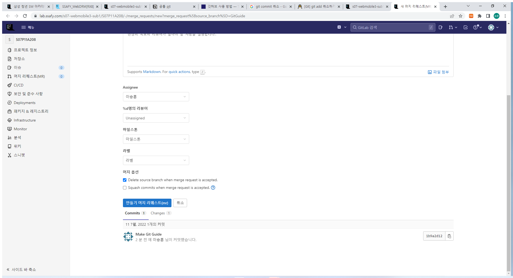
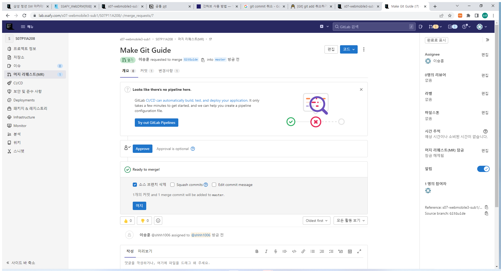
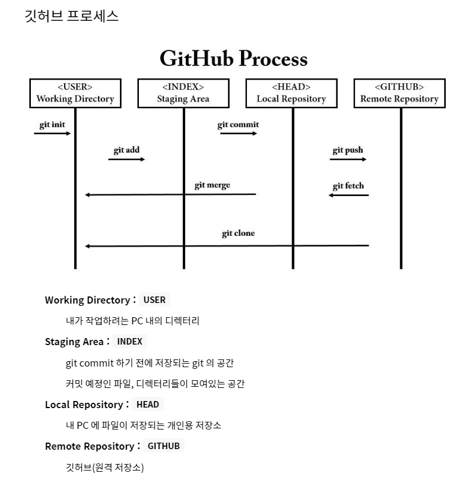

# 처음 git을 쓸 때

1. Git 다운로드받기 (선영이가 올려준 pdf파일따라서 진행하면 됨)

2. Git Bash 창에서 이메일 등록하기

   ```
   $git config --global user.email "깃랩 이메일"
   ```

3. 바탕화면이든 어디든 아무데나 우클릭하고 Git Bash 실행해서 깃랩에서 클론따오기

   ```
   $git clone https://lab.ssafy.com/s07-webmobile3-sub1/S07P11A208.git
   ```

4. 그러면 `S07P11A208` 폴더가 만들어짐

5. 해당 pc에서 맨 처음 커밋할때는 

   ``` 
   $git remote add origin https://lab.ssafy.com/s07-webmobile3-sub1/S07P11A208.git

​	을 입력한다.

# 이후 개발 (무한반복)

1. 브랜치 만들기 (브랜치를 create해서 현재 브랜치에서 만들어진 브랜치로 이동하는 것까지 포함된 명령어)

``` 
$git switch -c 브랜치이름 (따옴표 쓸 필요 없음)
```

2. 개발이 끝나면 git add 하기(add 띄우고 .)

``` 
$git add .
```

3. 커밋하기

``` 
$git commit -m '커밋메시지'
```

4. 푸시하기

```
$ git push origin 브랜치이름
```

5. 뜨는 링크 들어가서 머지 리퀘스트 만들기

* 빨간줄 그어진 링크로 들어가기


* 머지 리퀘스트 만들기 (버튼 클릭)



* 승인하고 머지하기 (Approve버튼 누르고 머지 버튼 누르기)



6. 다 끝나면 마스터 브랜치로 전환해서 머지된 결과 받아오기

```
$git switch master
$git pull origin master
$git branch -d 브랜치이름 
```

# 간략한 깃허브 프로세스




