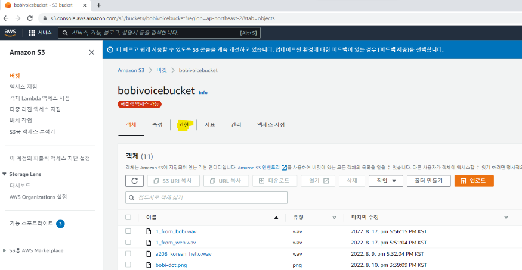
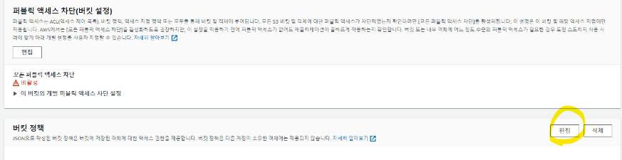
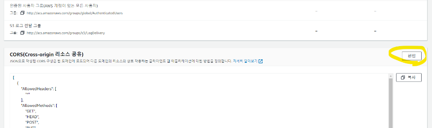
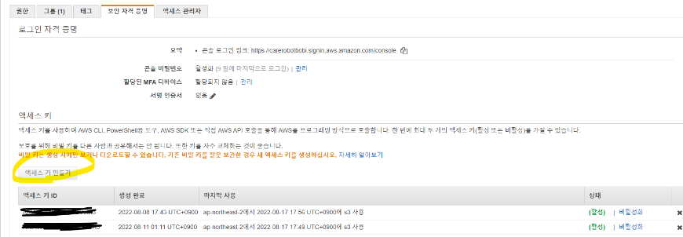
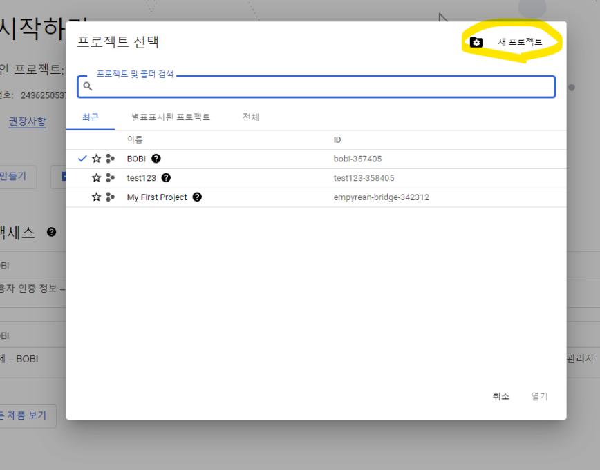

## BOBI-FE

```
📁 FE
├─bobi_frontend			// 현재 배포되어있는 서버 기준
├─DOCS	
├─README.md
└─test					// 로컬 테스트용 (mqtt 등)
```


## 환경

- ECMAScript 6 기반의 웹페이지

- PWA를 활용한 웹앱 형태

  

## 사전 준비

1. CRA를 이용해서 따로 webpack 설정없이 프론트엔드 개발환경 설정
2. React 18.2.0

```jsx
$ git clone <https://lab.ssafy.com/s07-webmobile3-sub2/S07P12A208.git>
$ git switch FE
$ cd FE
$ cd bobi_frontend
$ npm i --force
$ npm start
```


## 사용한 라이브러리

1. 반응형 웹 페이지

- react-router-dom 6.3.0

1. 구글 로그인

- react-google-login 5.2.2
- gapi-script 1.2.0

1. mqtt 통신

- mqtt 4.3.7

1. S3 업로드

- react-s3 1.3.1

1. 음성 재생 플레이어

- react-player 2.10.1

1. 센서 값 그래프

- react-apexcharts 1.4.0

1. 이모티콘

- @fortawesome/react-fontawesome 0.2.0

- @fortawesome/free-solid-svg-icons 6.1.2

  

# Web to S3, S3 to Web Authorization

> S3 버킷 생성은 링크(추가예정) 참조

1. 버킷에 내부의 권한 탭 이동

   


2. 퍼블릭 액세스 차단 편집


모든 차단 해제하기


3. 버킷 정책 수정하기




편집을 클릭하고 아래와 같이 입력하고 변경사항 저장

```jsx
{
	"Version": "2012-10-17",
	"Statement": [
		{
			"Sid": "PublicReadGetObject",
			"Effect": "Allow",
			"Principal": "*",
			"Action": "s3:GetObject",
			"Resource": "arn:aws:s3:::bobivoicebucket/*"
		}
	]
}
```


4. CORS 정책 수정하기

```jsx
[
    {
        "AllowedHeaders": [
            "*"
        ],
        "AllowedMethods": [
            "GET",
            "HEAD",
            "POST",
            "PUT"
        ],
        "AllowedOrigins": [
            "*"
        ],
        "ExposeHeaders": [
            "Access-Control-Allow-Origin",
            "x-amz-server-side-encryption",
            "x-amz-request-id",
            "x-amz-id-2"
        ]
    }
]
```

5. 액세스 키 발급받기

우측 상단 보안자격증명 이동


편집을 클릭하고 아래와 같이 입력하고 변경사항저장



액세스 관리 - 사용자 탭 이동


Administrator 이동


보안 자격 증명 탭 이동


Access Key 만들고 Access Key, Secret Access Key값 기록하기 (액세스 키는 2개까지 받을 수 있어서 현재는 비활성화 상태)



```jsx
import { uploadFile } from "react-s3";

...

const config = {
  bucketName: S3_BUCKET,
  region: REGION,
  accessKeyId: ACCESS_KEY,
  secretAccessKey: SECRET_ACCESS_KEY,
};

...

uploadFile(file, config)
  .then((data) => console.log(data))
  .catch((err) => console.error(err));
```

7. 다운로드 할 때


# 구글 로그인 (클라이언트사이드)

1. 구글 클라우드 플랫폼 접속해서 로그인하기 https://console.cloud.google.com/
2. 새 프로젝트 생성





3. 프로젝트 탭 다시 클릭해서 생성한 프로젝트로 이동하기


4. 사용자 인증 정보로 이동


5. OAuth 클라이언트 ID 발급받기


6. 애플리케이션 유형 정하기


7. 이름 입력하고 구글 로그인 적용할 사이트 URI 쓰고 리디렉션 URI 입력하기


1. 웹에 적용하기

```jsx
import { GoogleLogin } from "react-google-login";
import { gapi } from "gapi-script";

...

const googleClientId = process.env.REACT_APP_GOOGLE_API_KEY;

useEffect(() => {
  function start() {
    gapi.client.init({
      clientId: googleClientId,
      scope: "email",
    });
  }
  gapi.load("client:auth2", start);
}, []);

const onSuccess = (response) => {
  // 로그인 성공했을 때 실행할 함수
};

const onFailure = (response) => {
	// 로그인 실패했을 때 실행할 함수
};

<GoogleLogin
  clientId={googleClientId}
  onSuccess={onSuccess}
  onFailure={onFailure}
/>
```


react-google-login은 옛날 라이브러리라서 그런지 npm install 할 때마다 빨간 오류가 자꾸 뜨는데 다른 라이브러리로 대체 권장

###### Tech Stack

- React


>>>>>>> e093068866a1e97bf6af0376e0c88635ec9e224c
