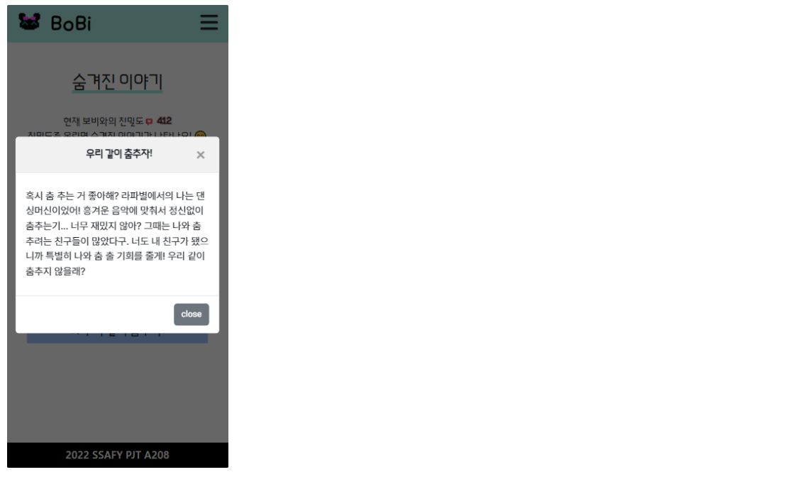
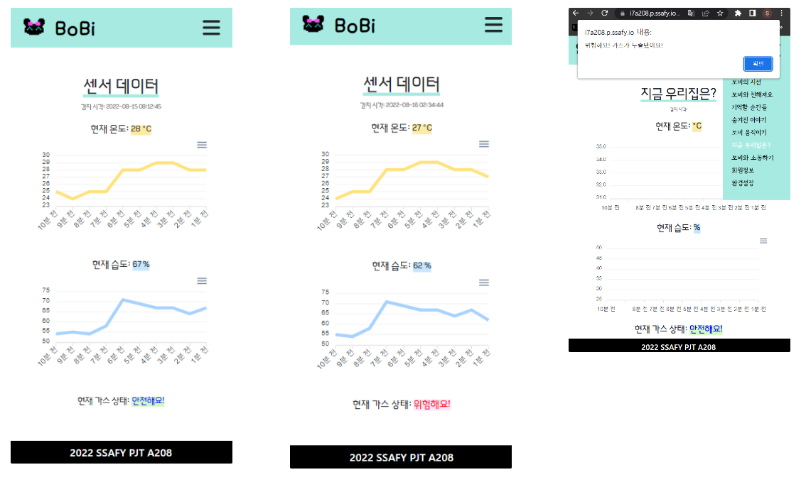
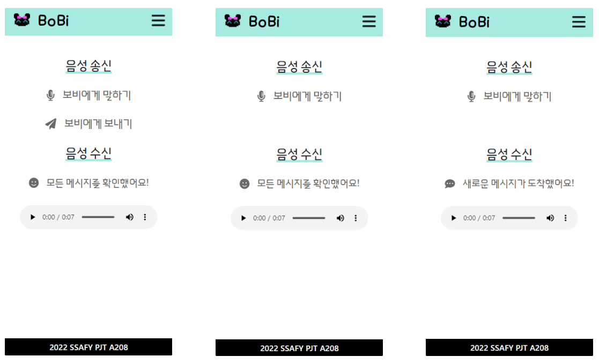
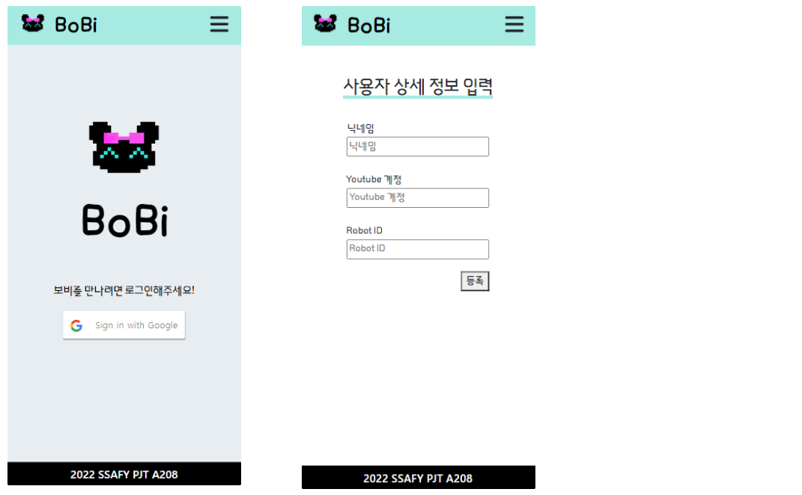

# BoBi - Web

> 관찰형 반려 케어 로봇 BoBi  ::  *보비[명] 보조하여 돌봄*
>
> 배포서버 👉 https://i7a208.p.ssafy.io/


## 👨‍💻 팀원 소개 및 업무 분담

**FE (+BE) / Web** [이승훈](https://github.com/2squarehoon)  

**BE (+ FE) / Web** [신선영](https://github.com/drsuneamer/TEMPLIX-2022/blob/master/[]())


## 🗓 프로젝트 기간

`2022. 07. 05 ~ 2022. 08. 19`


## 🛠 기술 스택

**FrontEnd**  React / JavaScript / HTML / CSS / Bootstrap / MQTT / S3

**BackEnd**  Python / Django 


## 🤖 프로젝트 구현

#### 페이지 소개

> Samsung Galaxy S8+ 기준 캡처 페이지

- `보비의 시선` 실시간 영상

- `보비와 친해져요` 친밀도(경험치) 확인

- `기억할 순간들` 영상 아카이브

- `숨겨진 이야기` 친밀도에 따른 스토리 해금

- `보비 움직이기` MQTT 통한 로봇 원격 조작

- `지금 우리집은?` 센서를 통한 온습도/가스 상태 확인

- `보비와 소통하기` 음성메시지 송수신


###### 기본 페이지 (https://i7a208.p.ssafy.io/)

- 상세 메뉴

  


###### 실시간 영상 (https://i7a208.p.ssafy.io/live)

- 보비가 촬영중인 영상 유튜브라이브로 실시간 확인 가능

  


###### 친밀도 (https://i7a208.p.ssafy.io/friendliness)

- 현재 친밀도 확인, 다음 레벨 (새로운 스토리와 행동 해금)까지 남은 친밀도 확인

  


###### 스토리 (https://i7a208.p.ssafy.io/story/)

- 친밀도에 따라 스토리 해금 및 확인 가능

- 친밀도는 로봇을 쓰다듬거나 명령어를 작동시키는 등의 행동에 의해 상승

- `0` 기본 스토리[1] 공개  `100` 달성 시 [2] 공개 `200` [3] `300` [4] `400` [5]

  

  

  

  


###### 로봇 조작 (https://i7a208.p.ssafy.io/control)

- 유튜브 라이브로 실시간 영상을 확인하며, 전후좌우 조작 가능

- 허용된 이메일 (현재는 관리자인 carerobotbobi 계정)으로 접속해야 조작 가능

  


###### 센서 페이지 (https://i7a208.p.ssafy.io/sensor)

- 감지 시간 / 현재 온도 / 현재 습도 / 가스 상태 표시

- 최근 10개 데이터를 포함한 그래프 출력

- 가스 상태: 이상 감지 시 `위험해요` 표시, 미감지 시 `안전해요` 표시

- 가스 위험 상태시 `위험해요! 가스가 누출됐어요!` 경고창 출력

  


###### 음성 송수신 (https://i7a208.p.ssafy.io/voice/)

- 수신

  - 새 메시지 도착 시 `새로운 메시지가 도착했어요!` 문구 확인 가능
  - 확인 후 메시지 클릭 시 `모든 메시지를 확인했어요!` 로 변경

- 송신

  - `보비에게 말하기` 버튼 클릭 후 녹음 완료 시 `보비에게 보내기` 버튼 생성
  - 클릭 시 `제출하시겠습니까?` 문구 출력

  


###### 로그인 (https://i7a208.p.ssafy.io/login)

- 메인 페이지로 접속 시 로그인이 되어 있지 않으면 로그인 페이지로 이동

- 로그인 완료 시 사용자 상세 정보 입력 페이지로 이동 (https://i7a208.p.ssafy.io/user-detail)

  


###### 회원정보 (https://i7a208.p.ssafy.io/user/)

- 닉네임, 유튜브 계정 입력 시 회원정보 확인 가능

  


###### 환경설정 (https://i7a208.p.ssafy.io/config) 

- 회원정보수정, 로그아웃, 회원탈퇴 가능

  

  

#### URL

```
# 웹페이지
https://i7a208.p.ssafy.io/     // 메인 페이지
https://i7a208.p.ssafy.io/intro      // 설정 소개 페이지
https://i7a208.p.ssafy.io/live    // 실시간 유튜브 라이브 영상 재생
https://i7a208.p.ssafy.io/friendliness     // 현재 친밀도 확인
https://i7a208.p.ssafy.io/archive-video    // 영상 아카이브
https://i7a208.p.ssafy.io/story     // 스토리 텍스트 확인
https://i7a208.p.ssafy.io/control     // 로봇 조작 (배포 서버에서는 작동 X)
https://i7a208.p.ssafy.io/sensor     // 센서 데이터 확인
https://i7a208.p.ssafy.io/voice     // 음성 메시지 송수신
https://i7a208.p.ssafy.io/login // 로그인_미로그인시에만 접근 가능
https://i7a208.p.ssafy.io/user-detail  // 사용자 상세 정보 입력, 정보를 입력하지 않았을 시에만 접근 가능
https://i7a208.p.ssafy.io/user    // 회원정보 확인
https://i7a208.p.ssafy.io/config    // 환경설정

# api (DB 확인)
https://i7a208.p.ssafy.io/api/v1/sensors/    // 센서 데이터
https://i7a208.p.ssafy.io/api/v1/robots/    // 경험치
https://i7a208.p.ssafy.io/api/v1/stories/     // 스토리
https://i7a208.p.ssafy.io/api/v1/voicecheck/    // 음성 수신 알림
https://i7a208.p.ssafy.io/api/v1/archivevideos/    // 영상 아카이브
https://i7a208.p.ssafy.io/api/v1/fakeusers/     // 사용자
```


## 😢 목표서비스 구현 실패 목록ㅠㅠ

- PWA 앱 형태 (가스 감지 시 푸쉬 알림 등)  -- PC로 페이지 접속 시 모바일 환경에 최적화되어있다는 정보 제공
- 이미지 아카이브 - youtube 재생 화면 client side 캡처 오류 등의 문제
- https 환경 웹소켓 연결


## 🙂 느낀점

- 신선영


## 🌳 전체 개요 - 파일트리

#### FE

```
📂 bobi_frontend
├─build
├─node_modules		// 설치 완료된 모듈
├─public
│  ├─index.html
│  ├─manifest.json
├─src
│  App.css
│  App.jsx
│  index.css
│  index.js
│  
├─components
│  │  ArchiveDropdown.js		// 사용 X
│  │  ControlButton.jsx
│  │  ControlButtonDummy.jsx		// 배포용 작동 X 버튼
│  │  Dropdown.js
│  │  GoogleButton.js		// 구글 로그인 버튼
│  │  Graph.jsx			// 온도 그래프
│  │  Graph1.jsx		// 습도 그래프
│  │  UserForm.jsx
│  │  
│  ├─archive
│  │      ArchiveForm.jsx
│  │      ArchiveImageForm.jsx
│  │      ArchiveImageItem.jsx
│  │      archiveImageWrite.jsx
│  │      ArchiveVideoForm.jsx
│  │      ArchiveVideoItem.jsx
│  │      
│  ├─modal
│  │      Modal.js
│  │      VoiceModal.js
│  │      
│  ├─story
│  │      HiddenStory.jsx	// 해금 X 스토리 (클릭 X)
│  │      StoryItem1.jsx
│  │      StoryItem2.jsx
│  │      StoryItem3.jsx
│  │      StoryItem4.jsx
│  │      StoryItem5.jsx
│  │      
│  └─voice
│          VoicePlay.jsx
│          VoiceRecord.jsx
│          
├─layout
│  │  Layout.jsx	 // 전체 레이아웃 적용
│  │  
│  ├─footer
│  │      Footer.jsx
│  │      
│  └─header
│          ArchiveMenu.jsx
│          Header.jsx
│          HeaderMenu.jsx
│          
└─pages
    │  Config.jsx		// 환경 설정
    │  Control.jsx		// 로봇 조작
    │  Friendliness.jsx		// 친밀도
    │  Intro.jsx		// 서비스 소개
    │  Live.jsx		// 실시간 영상 확인
    │  Login.jsx		// 로그인
    │  Main.jsx		// 메인 페이지	
    │  Sensor.jsx		// 센서 값 확인
    │  Story.jsx	// 해금된 스토리
    │  User.jsx
    │  UserDetail.jsx
    │  UserDetailEdit.jsx
    │  Voice.jsx		// 음성 송수신
    │  	
    └─archive
            ArchiveImage.jsx
            ArchiveImageDetail.jsx
            ArchiveImageUpdate.jsx
            ArchiveVideo.jsx
            ArchiveVideoDetail.jsx
            ArchiveVideoUpdate.jsx
            ArchiveVideoWrite.jsx
└─package.json  	// 설치 패키지 정보
```

#### BE

```
📂 BoBi
├─.config	// 서버 배포용 설정 파일
│  ├─nginx
│  └─uwsgi
├─accounts		// user 정보
├─archives			// 영상 아카이브
├─bobi			// 센서, 친밀도 등 로봇 저장 데이터
├─bobi_backend		// url, DB 세팅 등
├─bobi_frontend		// FE 빌드 파일	
├─movements
├─stories
├─voices
└─my_settings.py		// DB 설정 등 (개인정보 포함)
```


